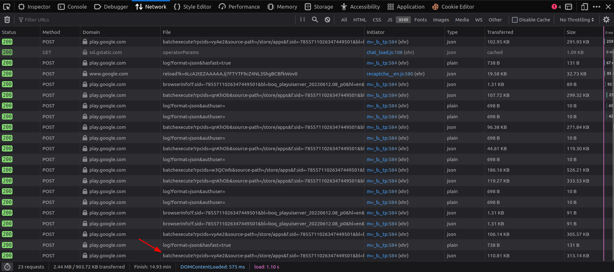
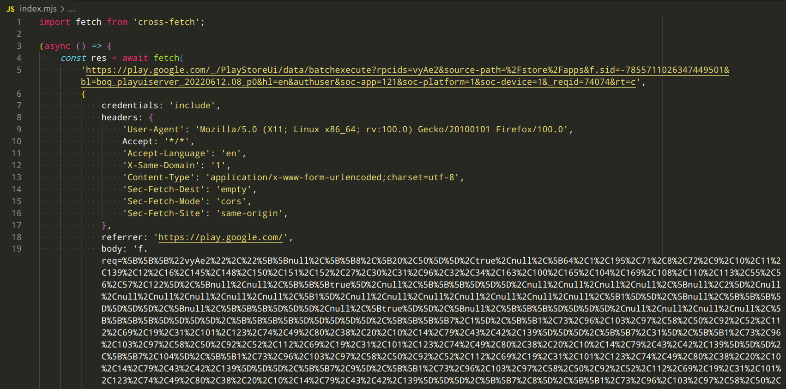
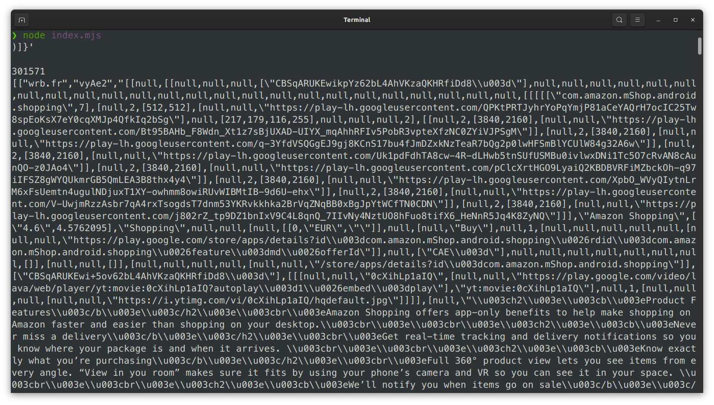
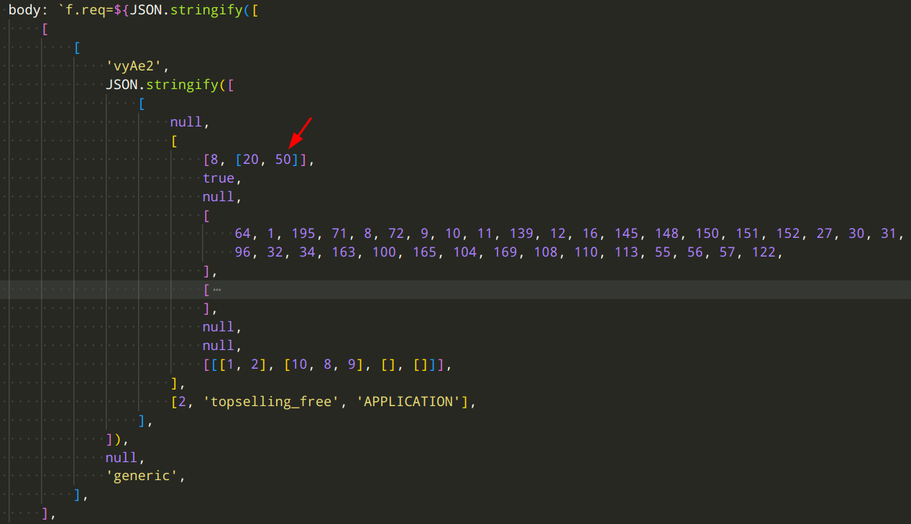

<div class="box info">
    <p>This blog post is a lightly edited version of this <a href="https://mastodon.social/@baltpeter/108489492199400177">Mastodon thread</a>.</p>
    <p>If you just want a way to programmatically access Play Store top charts, you can go straight to the <a href="https://github.com/baltpeter/parse-play"><code>parse-play</code> NPM package</a>.</p>
</div>

For my mobile privacy research, I need programmatic access to the rankings of which apps are most popular, the top charts.

On Android, I already had a scraper for the Play Store website that could fetch the top 200 apps per category. But a recent redesign broke that scraper, and the top chart pages I used don’t seem to exist at all anymore. Buying the data from a third-party company is not an option. Time to finally reverse-engineer the obfuscated APIs that the Play Store uses internally.

If you go to the [Play Store website](https://play.google.com/store/apps), there _is_ still a “top charts“ section, but it now only lists the top 45 apps (which is not enough). Also, we can only see the ranking across all apps, not for individual categories.


However, those things might well only be UI limitations. It still makes sense to look at how that data is fetched and hope that the internal API used to display these charts is more powerful than that.

So, let’s reload the page but this time with the Firefox dev tools open to the network tab, so we can observe the network traffic. Since there’s a lot of traffic, mostly for images and scripts (which we don’t care about), we’ll filter for XHR requests only.

Apart from a whole bunch of tracking (bad but hardly surprising…), there are a few requests to an endpoint named `batchexecute` on `play.google.com`, each at around 100KB of data transferred. Those look promising.

![Screenshot of the network tab in the Firefox dev tools. A list of network requests is shown. The requests are filtered using the “XHR” button in the top menu bar. The button is pointed out by an arrow. One POST request goes to www.google-analytics.com with a path of /collect. Another GET request went to ssl.gstatic.com with a path of /operatorParams. The remaining requests are all POST requests to play.google.com with different paths, namely /batchexecute, /log, and /browserinfo. The /batchexecute ones are pointed out by an arrow. They all have a transferred size around 100KB, which is highlighted by boxes.](so-let-s-reload-the-page-but-this-time-with-the.png)

The requests have an `rpcids` parameter with different values, namely `vyAe2`, `qnKhOb`, and `w3QCWb`. That might select what data is returned. But how do we know which one is for the top charts? Let’s try switching from “Top for €0” to “Top grossing”.


Bingo! There’s a new `batchexecute` request with `rpcids` set to `vyAe2`. It’s pretty likely that we’ve found the endpoint responsible for top charts. Just for good measure: Switching to “Top selling” produces yet another `vyAe2` request.



By the way: Shout-out to Manuel for figuring out what the other two `rpcids` do in their [bachelor’s thesis](http://dbis.eprints.uni-ulm.de/1935/1/BA-Schmid.pdf). `qnKhOb` is also used in a [few libaries](https://cs.github.com/?scopeName=All+repos&scope=&q=%2F%5CbqnKhOb%5Cb%2F). But seems like [no-one](https://cs.github.com/?scopeName=All+repos&scope=&q=%2F%5CbvyAe2%5Cb%2F) has figured out `vyAe2` yet. Anyway, back to doing just that…

Looking at the obfuscated request and response content is pretty intimidating.


The request is `x-www-form-urlencoded` with `f.req`, a string of various deeply nested JSON arrays without any labels to help us understand what is what. Just like [Protobuf](https://en.wikipedia.org/wiki/Protocol_Buffers).

The response is similar but has three of those nested arrays, a few numbers, and garbage for the first line. The fourth line is the longest by far and seems to hold all data.

![A screenshot of the “Response“ tab for a request in the network dev tools. The response consists of multiple lines: The first line contains garbage characters: )\]}' The second, and ninth lines are blank. The third, fifth, and seventh lines contain numbers with no apparent meaning. The fourth, sixth, and eighth lines contain JSON arrays with many levels of nesting similar to the request in the previous image.](looking-at-the-obfuscated-request-and-response-con-2.png)

And scrolling to the right, we actually see references to our top apps.


I found this great [post which has some general details on how `batchexecute` works](https://kovatch.medium.com/deciphering-google-batchexecute-74991e4e446c). With that background info, this doesn’t look too bad.

But before we go any further, I tried just replicating the exact request the website did. In the dev tools, we can just right-click -> “Copy as Fetch” and paste that into a new NodeJS script, using [cross-fetch](https://github.com/lquixada/cross-fetch) as a fetch ponyfill.



And it does actually work! We get the same response.



If you want to follow along, I made a [Gist with the code and output](https://gist.github.com/baltpeter/8da474fb08990c80ce74f62c965ac4d5).

Next, let’s try to simplify the request to make it easier to understand what’s going on. I’ll start with the headers. Through simple experimentation I found that we only need one:

```
Content-Type: application/x-www-form-urlencoded;charset=utf-8
```

Next up: The query string. Here, it turns out that all GET parameters are actually optional and don’t seem to affect the request (apart from `rt` which sets the response format, see the [previously mentioned blog post](https://kovatch.medium.com/deciphering-google-batchexecute-74991e4e446c)—but leaving it empty is better even). This is easy so far!

But now we do actually need to tackle that unwieldy request payload. To make it a easier to read, I’ll URL-decode it and use two nested `JSON.stringify()` calls to generate the string. Trying to understand that huge mess in your head is nigh on impossible otherwise.

![Screenshot of source code for fetching the top charts data as in previous images, showing only the request body. Unlike before, the body is not a single unreadable string but constructed by calling JSON.stringify() on an array containing three nested arrays. The first value in the innermost array is the string vyAe2, the second value is constructed by again calling JSON.stringify() on nested array with no apparent meaning. Due to the length of the arrays, the screenshot is cut off at the bottom. The full code is available in the Gist linked below.](but-now-we-do-actually-need-to-tackle-that-unwield.png)

After formatting the file, the JSON object is now an insane 600 lines long—wow! How many parameters can there be for fetching app top charts?! But at least we have a chance at understanding it now. [Gist with the formatted request body](https://gist.github.com/baltpeter/f37a7236c325deb25e23d01c2e7e6ada)

Most of the length comes from an array at the third level of the inner JSON array. If we collapse that, the payload looks a lot more approachable. We’ll treat that as a black box for now.


In fact: Those two array elements near the end look very interesting, don’t they? `topselling_free` definitely sounds like it controls the chart. Looking at the other two requests we observed confirms this:

* `topselling_free` is “Top for €0”
* `topgrossing` is “Top grossing”
* `topselling_paid` is “Top selling”

And changing the value in our code actually returns different values! One parameter down.

On to the next one. `APPLICATION` sounds like it might control the category.

For some reason, Google seems to hide the category pages in the new Play Store design. But we can still find [lists of the categories and their ID](https://42matters.com/docs/app-market-data/android/apps/google-play-categories).

Using one of the other category IDs in our code also works. We can now fetch top charts for different categories, which is not possible in the UI anymore. Progress.

We’ll leave the request for a moment to look at the response. If we again format the line with the data as JSON, and then also format the nested JSON string, we can collapse sections of the response to exploratively get an understanding of it. [Gist of the formatted response](https://gist.github.com/baltpeter/67c61dc9a610ccfbda78be60559813bd)

Nested quite deeply in there, we find an array of entries that distinctly look like they represent the apps on our top list.

![A screenshot of the cleaned-up and formatted response from running the same top charts request as previously. The screenshot starts somewhere in the middle of the JSON response, already nested quite deeply. An array containing a multitude of nested arrays is shown. The first few of these inner arrays are collapsed. The bottom one is expanded (and cut off). Notably, it contains the string com.whatsapp and a URL to an image on play-lh.googleusercontent.com. The full response is available in the Gist linked above.](we-ll-leave-the-request-for-a-moment-to-look-at-th.png)

Each entry lists a bunch of metadata on the app, like ID, name, rating, category, description.


With that, we can basically decode the response already. All that’s left is figuring out what each value means (easy enough with the app detail pages to compare against) and then writing code to grab them from within that mess of a JSON array. I’ll spare you the gory details.

But one more exciting observation: The array with the apps has _50_ entries. We can already access five more apps than through the web UI. Surely that means that we can grab even more if we figure out the length parameter?

Why yes, we can! By chance, I noticed that the request payload contains a 50 near the beginning.



And what do you know? Changing that value does indeed influence the length of the list returned in the response. That length seems to be capped to 660 on the server. But that’s way more than we could access before, so I’m happy.

It also just so happens to be about the length of the charts of most third-party companies. Whoops, now you don’t to pay them anymore for that. Sorry not sorry…

We’re finally almost done. Currently, we get the results in the language and for the country that Google detects we’re it. It would be nice to control that.

Luckily, that’s also easy: You can just append the well-known `hl` (language) and `gl` (country) parameters that Google uses in many places to the query string of the URL. Their values are the typical two-letter ISO codes. 
So for example, to get the top charts for the United Kingdom in English, you’d use:

```
https://play.google.com/%5F/PlayStoreUi/data/batchexecute?hl=en&gl=gb
```

Remember how we ignored a huge part of the request payload? I won’t bore you with the details but by trial-and-error I discovered that that is entirely irrelevant for the request and you can just leave it and a bunch of other stuff out completely. [Gist with the simplified request code](https://gist.github.com/baltpeter/97a5a921ee52253a96b7e546e41c4f4c)


Look at how ridiculously more simple we can make the request compared to what the Play Store website sends. Now, I don’t know what all the removed values do. But I wouldn’t be surprised if they were for all tracking…

If you want to access the top charts of Android apps on the Google Play Store, I wrote a nice JavaScript library that you can use: [`parse-play`](https://github.com/baltpeter/parse-play)

With that, it’s as easy as:

```js
const topChart = await fetchTopCharts( 
 { category: 'APPLICATION', chart: 'topselling_free', count: 100 }, 
 { country: 'DE', language: 'EN' } 
);
```
